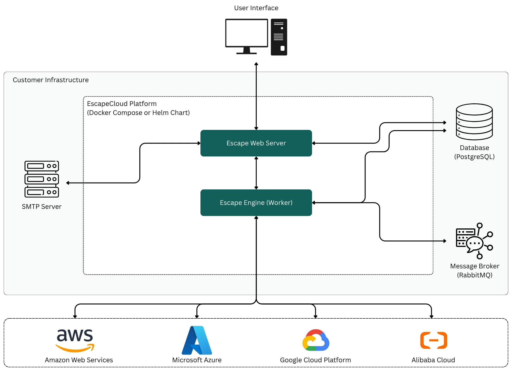

# Architecture

EscapeCloud Platform is deployed within customer-controlled infrastructure and is composed of a web-facing application layer, background processing, and supporting data services.

The platform can be deployed using Docker Compose or Helm, depending on the target environment and operational requirements.

## High-Level Architecture

The diagram shows the high-level runtime boundary of the platform, including the user-facing application, background worker services, database, message broker, and cloud provider integrations.

## Platform Interaction Model

- The Web Application provides the primary user interface for interacting with the platform.
- The Assessment Engine handles background processing and platform-side execution.
- PostgreSQL provides persistent platform storage.
- RabbitMQ provides messaging between platform services and background tasks.
- SMTP integration supports outbound notification delivery.
- The platform interacts with supported public cloud providers for assessment and analysis.

## Architecture Scope

This section describes the high-level platform structure only. It does not cover internal assessment logic, product workflows, or implementation-specific processing behavior.
